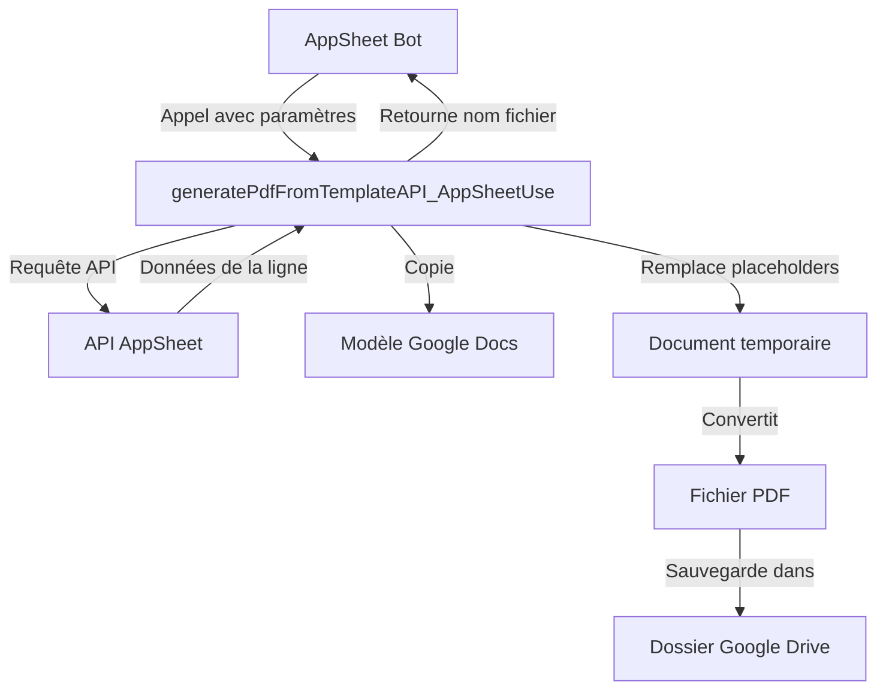

# Plan d'implémentation : Fonction generatePdfFromTemplateAPI_AppSheetUse()

## Objectif
Créer une nouvelle fonction qui génère des PDF personnalisés en utilisant l'API AppSheet comme source de données au lieu d'un accès direct à Google Sheets.

## Architecture

### Flux de données
1. AppSheet appelle la fonction via un bot d'automatisation
2. La fonction utilise l'API AppSheet pour récupérer les données nécessaires
3. La fonction utilise ces données pour générer un PDF à partir d'un modèle Google Docs
4. Le PDF est enregistré dans Google Drive
5. Le nom du fichier PDF est retourné à AppSheet



### Modifications nécessaires
- Ajouter une nouvelle fonction point d'entrée
- Implémenter l'authentification à l'API AppSheet
- Adapter la logique de récupération des données

### Paramètres de la fonction
1. `uniqueId` - Identifiant unique de l'enregistrement à traiter
2. `appsheetAppId` - ID de l'application AppSheet
3. `appsheetAccessKey` - Clé d'accès API AppSheet 
4. `tableName` - Nom de la table AppSheet contenant les données
5. `templateDocId` - ID du modèle Google Docs
6. `destinationFolderId` - ID du dossier de destination
7. `uniqueIdColumnName` - Nom de la colonne ID dans la table AppSheet
8. `pdfFilenameTemplate` - Modèle pour le nom du fichier PDF
9. `deleteTempDocStr` - Supprimer ou non le document temporaire

## Considérations techniques

### Authentification à l'API AppSheet
L'authentification se fera via l'en-tête HTTP `ApplicationAccessKey` :

```javascript
const headers = {
  'ApplicationAccessKey': appsheetAccessKey,
  'Content-Type': 'application/json'
};
```

### Récupération des données
Utilisation de l'action `Find` avec un filtre sur la colonne ID spécifiée :

```javascript
const requestBody = {
  Action: "Find",
  Properties: {
    Filter: `${uniqueIdColumnName} = '${uniqueId}'`
  }
};
```

### Format de données
Conversion du format de données de l'API AppSheet vers le format attendu pour le remplacement des placeholders :

```javascript
// Format API AppSheet
{
  "id": "1",
  "nom": "Dupont",
  "email": "dupont@example.com",
  ...
}

// Format attendu pour les placeholders
{
  "{{id}}": "1",
  "{{nom}}": "Dupont",
  "{{email}}": "dupont@example.com",
  ...
}
```

### URL de l'API AppSheet
```
https://api.appsheet.com/api/v2/apps/{appId}/tables/{tableName}/Action
```

### Réutilisation du code existant
La partie génération du PDF réutilisera le code de `generatePdfFromTemplate()`, notamment :
- Création d'une copie du modèle Google Docs
- Remplacement des placeholders
- Génération du PDF
- Gestion des noms de fichiers uniques

### Gestion des erreurs
Implementation d'une gestion d'erreurs robuste, notamment pour les erreurs API :
- Erreurs d'authentification (401)
- Erreurs d'accès (403)
- Ressources non trouvées (404)
- Erreurs de syntaxe de filtre
- Problèmes de connectivité réseau

### Scopes OAuth requis
Ajout du scope pour les requêtes externes :
```json
"oauthScopes": [
  "https://www.googleapis.com/auth/script.external_request",
  "https://www.googleapis.com/auth/spreadsheets",
  "https://www.googleapis.com/auth/documents",
  "https://www.googleapis.com/auth/drive"
]
```

## Comparaison des approches

| Aspect | generatePdfFromTemplate | generatePdfFromTemplateAPI_AppSheetUse |
|--------|-------------------------|----------------------------------------|
| Source données | Accès direct Google Sheets | API AppSheet |
| Authentification | Service Compte Google | Clé API AppSheet |
| Flexibilité | Limité à Google Sheets | Compatible avec toutes sources de données AppSheet |
| Performance | Meilleure pour petits volumes | Meilleure pour grands volumes |
| Complexité | Simple | Modérée (gestion API) |
| Maintenance | Indépendante d'AppSheet | Dépendante des évolutions API AppSheet |
